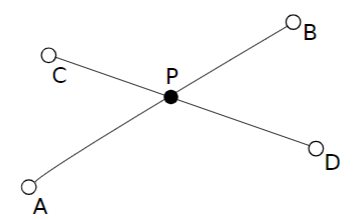
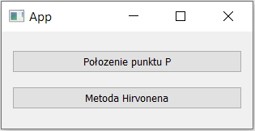
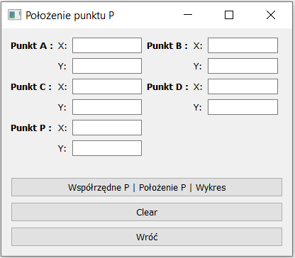
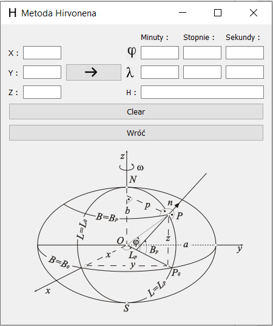

# PyQt5App

Simple application made in PyQt5 framework. There are two main features:
  1) Calculate intersection of two line segment (calculate P's coordinates based on another 4 points' coordinates). 
  
  
  2) Convert XYZ coordinates to fi, lambda, h coordinates - Hirvonen algorithm
  
  
# App

